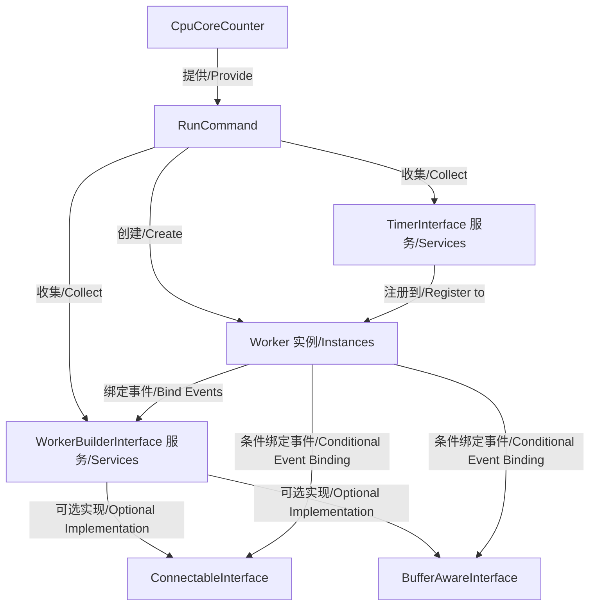

# Symfony Workerman Bundle / Symfony Workerman Bundle

基于 [Workerman](https://www.workerman.net/) 的 Symfony 集成模块，提供了在 Symfony 应用中使用 Workerman 高性能异步网络通信框架的能力。该模块通过抽象接口和服务标签系统，实现了 Workerman 与 Symfony 依赖注入容器的无缝集成。

A Symfony integration module based on [Workerman](https://www.workerman.net/), providing the capability to use the high-performance asynchronous network communication framework Workerman in Symfony applications. This module achieves seamless integration between Workerman and Symfony's dependency injection container through abstract interfaces and service tagging systems.

## 安装 / Installation

```bash
composer require loveyu/symfony-workerman-bundle
```

**支持版本 / Supported Versions:**
- Symfony 7.0+ / 8.0+
- PHP 8.3+ / 8.4+

## 核心功能与技术原理 / Core Features & Technical Principles

核心功能包括 / Core features include:

- 提供基于命令行的 Workerman 服务启动机制 / Provide command-line based Workerman service startup mechanism
- 自动发现并注册实现了特定接口的 Worker 服务 / Automatically discover and register Worker services implementing specific interfaces
- 支持 TCP/UDP 等多种网络协议的服务端实现 / Support multiple network protocols such as TCP/UDP for server implementation
- 提供缓冲区管理机制 / Provide buffer management mechanism
- 集成 Crontab 定时任务系统 / Integrate Crontab scheduled task system
- 自动根据 CPU 核心数优化 Worker 进程数量 / Automatically optimize Worker process count based on CPU core count

## 架构设计与关键类 / Architecture Design & Key Classes

### 核心接口 / Core Interfaces

Bundle 通过四个核心接口定义了 Workerman 服务的行为规范 / The Bundle defines Workerman service behavior specifications through four core interfaces:

1. **WorkerBuilderInterface**：Worker 服务的基础接口，定义了 Worker 的生命周期事件处理方法 / Basic interface for Worker services, defining Worker lifecycle event handling methods
   - `getName()`: 定义服务标识 / Define service identifier
   - `onWorkerStart()`: Worker 启动时的初始化逻辑 / Initialization logic when Worker starts
   - `onWorkerStop()`: Worker 停止时的清理逻辑 / Cleanup logic when Worker stops
   - `onWorkerReload()`: Worker 重载时的处理逻辑 / Processing logic when Worker reloads

2. **ConnectableInterface**：可连接的 Worker 服务接口，定义了网络连接相关的事件处理方法 / Connectable Worker service interface, defining network connection related event handling methods
   - `getTransport()`: 指定传输协议（tcp/udp） / Specify transport protocol (tcp/udp)
   - `getProtocolClass()`: 自定义协议处理类 / Custom protocol handling class
   - `getListenIp()/getListenPort()`: 监听配置 / Listening configuration
   - 连接生命周期事件：`onConnect/onClose/onMessage/onError` / Connection lifecycle events

3. **BufferAwareInterface**：缓冲区感知接口，定义了缓冲区管理相关的事件处理方法 / Buffer aware interface, defining buffer management related event handling methods
   - `onBufferFull()`: 发送缓冲区满时的处理 / Handle when send buffer is full
   - `onBufferDrain()`: 发送缓冲区清空时的处理 / Handle when send buffer is drained

4. **TimerInterface**：定时任务接口，基于 workerman/crontab 实现 / Timer task interface, implemented based on workerman/crontab
   - `getExpression()`: 定义 Cron 表达式 / Define Cron expression
   - `execute()`: 定时执行的任务逻辑 / Task logic executed on schedule

### 命令行组件 / Command Component

`RunCommand` 类是模块的核心执行入口，负责 / The `RunCommand` class is the core execution entry point of the module, responsible for:

- 收集所有标记为 `workerman.worker` 的服务 / Collect all services tagged with `workerman.worker`
- 收集并注册所有 `workerman.timer` 定时任务 / Collect and register all `workerman.timer` scheduled tasks
- 根据服务实现的接口类型配置 Worker 实例 / Configure Worker instances based on interface types implemented by services
- 设置 Worker 进程数量为 CPU 核心数 / Set Worker process count to CPU core count
- 配置 PID 文件和日志文件路径 / Configure PID file and log file paths
- 启动 Workerman 服务 / Start Workerman service

## 组件交互关系 / Component Interaction Relationships



## 使用方法 / Usage

### 基本用法 / Basic Usage

1. 创建实现 `WorkerBuilderInterface` 接口的服务 / Create a service implementing the `WorkerBuilderInterface` interface:

```php
use Loveyu\WorkermanBundle\Worker\WorkerBuilderInterface;

class MyWorker implements WorkerBuilderInterface
{
    public function getName(): string
    {
        return 'my_worker';
    }

    public function onWorkerStart(\Workerman\Worker $worker): void
    {
        // Worker 启动时的初始化逻辑 / Initialization logic when Worker starts
        echo "Worker started\n";
    }

    public function onWorkerStop(\Workerman\Worker $worker): void
    {
        // Worker 停止时的清理逻辑 / Cleanup logic when Worker stops
        echo "Worker stopped\n";
    }

    public function onWorkerReload(\Workerman\Worker $worker): void
    {
        // Worker 重载时的处理逻辑 / Processing logic when Worker reloads
        echo "Worker reloaded\n";
    }
}
```

2. 注册为 Symfony 服务 / Register as a Symfony service:

```yaml
# config/services.yaml
services:
    App\Workerman\MyWorker:
        tags:
            - { name: 'workerman.worker' }
```

3. 启动 Workerman 服务 / Start Workerman service:

```bash
php bin/console workerman:run
```

### 网络服务示例 / Network Service Example

```php
use Loveyu\WorkermanBundle\Worker\{WorkerBuilderInterface, ConnectableInterface};

class TcpServer implements WorkerBuilderInterface, ConnectableInterface
{
    public function getName(): string
    {
        return 'tcp_server';
    }

    public function getTransport(): string
    {
        return 'tcp';
    }

    public function getListenIp(): string
    {
        return '0.0.0.0';
    }

    public function getListenPort(): int
    {
        return 8080;
    }

    public function onConnect(\Workerman\Connection\TcpConnection $connection): void
    {
        echo "New connection from {$connection->getRemoteIp()}\n";
    }

    public function onMessage(\Workerman\Connection\TcpConnection $connection, string $data): void
    {
        $connection->send("Echo: " . $data);
    }

    public function onClose(\Workerman\Connection\TcpConnection $connection): void
    {
        echo "Connection closed\n";
    }

    public function onWorkerStart(\Workerman\Worker $worker): void {}
    public function onWorkerStop(\Workerman\Worker $worker): void {}
    public function onWorkerReload(\Workerman\Worker $worker): void {}
    public function onError(\Workerman\Connection\TcpConnection $connection, int $code, string $msg): void {}
}
```

### 定时任务示例 / Scheduled Task Example

```php
use Loveyu\WorkermanBundle\Timer\TimerInterface;

class MyTimer implements TimerInterface
{
    public function getExpression(): string
    {
        return '*/5 * * * *'; // 每5分钟执行一次 / Execute every 5 minutes
    }

    public function execute(): void
    {
        echo "Timer executed at " . date('Y-m-d H:i:s') . "\n";
    }
}
```

## 扩展机制 / Extension Mechanism

Bundle 采用标签自动配置机制实现扩展 / The Bundle uses tag-based auto-configuration for extension:

1. 实现 `WorkerBuilderInterface` 的服务会自动被标记为 `workerman.worker` / Services implementing `WorkerBuilderInterface` are automatically tagged as `workerman.worker`
2. 实现 `ConnectableInterface` 的服务会自动被标记为 `workerman.connectable` / Services implementing `ConnectableInterface` are automatically tagged as `workerman.connectable`
3. 实现 `BufferAwareInterface` 的服务会自动被标记为 `workerman.buffer-aware` / Services implementing `BufferAwareInterface` are automatically tagged as `workerman.buffer-aware`
4. 实现 `TimerInterface` 的服务会自动被标记为 `workerman.timer` / Services implementing `TimerInterface` are automatically tagged as `workerman.timer`

开发者只需实现相应接口，服务会被自动发现并集成到 Workerman 运行时中 / Developers only need to implement the corresponding interfaces, and services will be automatically discovered and integrated into the Workerman runtime.

## 配置 / Configuration

### 基本配置 / Basic Configuration

```yaml
# config/packages/workerman.yaml
workerman:
    workers:
        # 自定义 Worker 配置 / Custom Worker configuration
        app_worker:
            class: App\Workerman\MyWorker
            count: 4  # 进程数量 / Process count

    timers:
        # 自定义定时任务配置 / Custom timer configuration
        my_timer:
            class: App\Workerman\MyTimer
```

### 高级配置 / Advanced Configuration

```yaml
workerman:
    pid_file: '%kernel.project_dir%/var/workerman.pid'
    log_file: '%kernel.project_dir%/var/log/workerman.log'
    worker_count: auto  # 自动检测CPU核心数 / Auto-detect CPU core count
    reloadable: true
```

## 依赖关系 / Dependencies

- 核心依赖 / Core dependencies:
  - `workerman/workerman`: 提供底层网络通信框架 / Provides underlying network communication framework
  - `workerman/crontab`: 提供定时任务支持 / Provides scheduled task support
- 辅助依赖 / Auxiliary dependencies:
  - `fidry/cpu-core-counter`: 用于检测系统 CPU 核心数 / Used to detect system CPU core count
  - `phpinnacle/buffer`: 提供高效的二进制数据缓冲区处理 / Provides efficient binary data buffer processing

## 技术限制与注意事项 / Technical Limitations & Considerations

- Workerman 要求 PHP 运行在 CLI 模式下 / Workerman requires PHP to run in CLI mode
- 在生产环境中，应使用 daemon 模式运行服务 / In production environments, services should be run in daemon mode
- 由于 Workerman 采用多进程模型，需注意 / Since Workerman uses a multi-process model, please note:
  - 共享资源的并发访问问题 / Concurrent access issues with shared resources
  - 定时任务在每个 Worker 进程中都会执行 / Scheduled tasks execute in every Worker process
  - 服务实现类应避免保存状态，或确保状态在多进程环境下的一致性 / Service implementation classes should avoid maintaining state or ensure state consistency in multi-process environments
- 在高并发场景下 / In high-concurrency scenarios:
  - 应关注缓冲区管理以避免内存溢出 / Should focus on buffer management to avoid memory overflow
  - 合理设置 Worker 进程数，避免过多进程导致系统资源耗尽 / Reasonably set Worker process count to avoid system resource exhaustion due to too many processes
  - 对于 CPU 密集型任务，建议保持 Worker 数量等于 CPU 核心数 / For CPU-intensive tasks, it's recommended to keep Worker count equal to CPU core count
  - 对于 IO 密集型任务，可适当增加 Worker 数量 / For IO-intensive tasks, Worker count can be appropriately increased

## 参考文档 / References

- [Workerman 官方文档](https://www.workerman.net/doc) / [Workerman Official Documentation](https://www.workerman.net/doc)
- [Symfony Bundle 最佳实践](https://symfony.com/doc/current/bundles.html) / [Symfony Bundle Best Practices](https://symfony.com/doc/current/bundles.html)
- [Workerman GitHub](https://github.com/walkor/workerman)